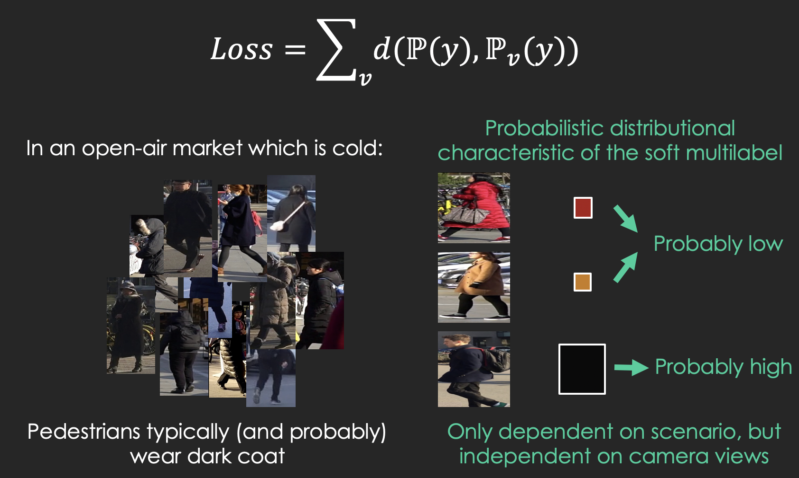
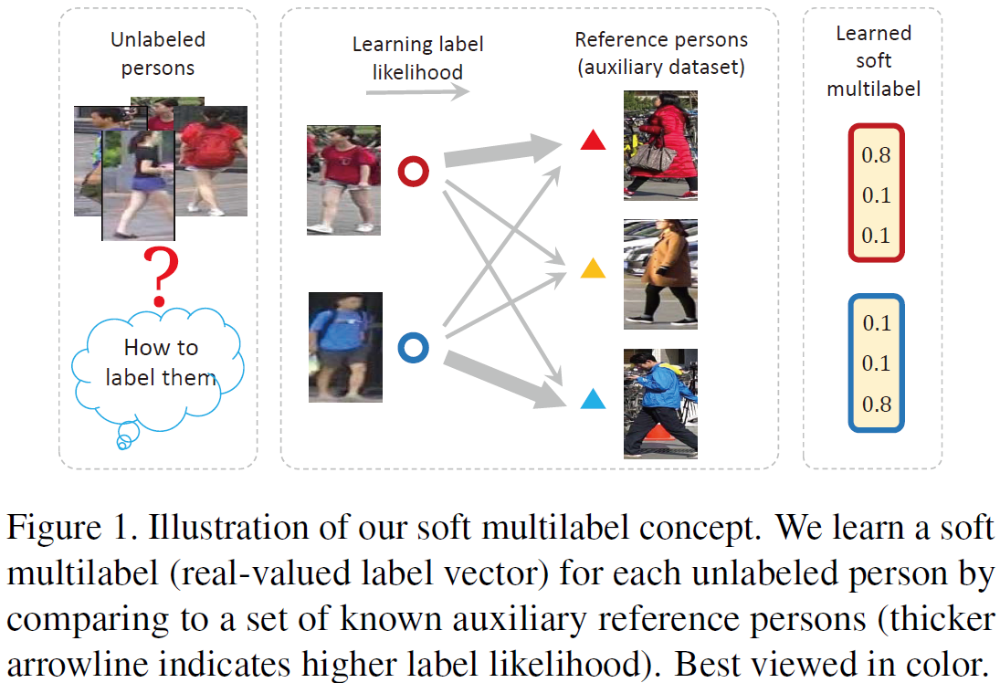
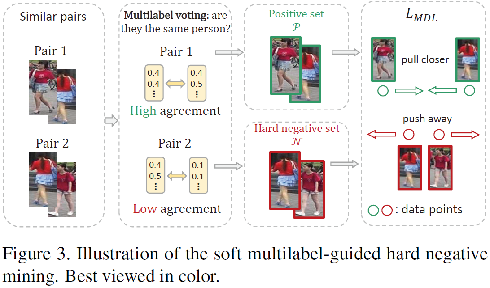
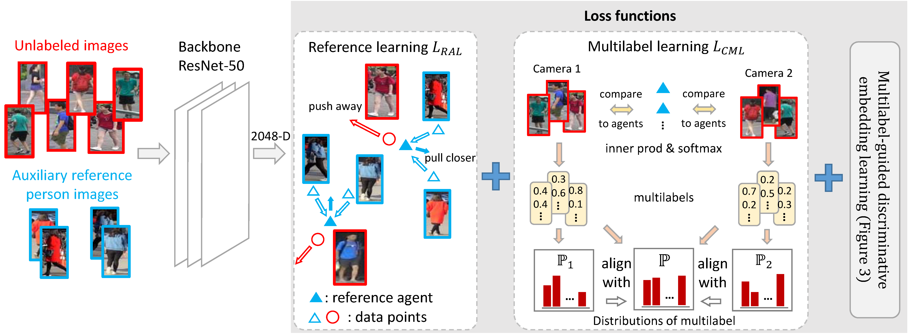
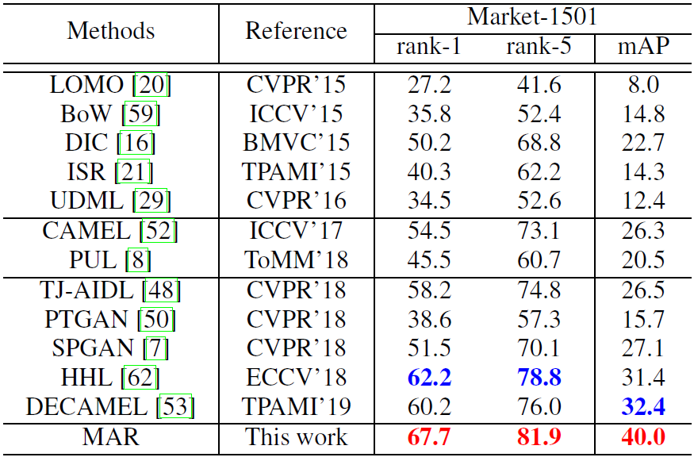
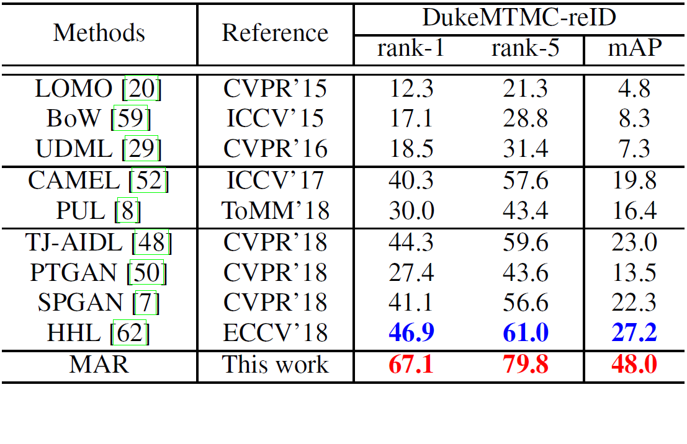

<!---
### update on 17th June: illustration for soft multilabel learning loss

-->

## [MAR: MultilAbel Reference Learning](https://kovenyu.com/papers/2019_CVPR_MAR.pdf)

  

This repo contains the source code for our CVPR'19 work
**Unsupervised person re-identification by soft multilabel learning** 
(the [paper](https://kovenyu.com/papers/2019_CVPR_MAR.pdf) 
and the [supplementary material](https://kovenyu.com/papers/2019_CVPR_MAR_supp.pdf)
is available).
Our implementation is based on [Pytorch](https://pytorch.org/).
In the following is an instruction to use the code
to train and evaluate the MAR model on the [Market-1501](
http://www.liangzheng.org/Project/project_reid.html) dataset.




### Prerequisites
1. [Pytorch 1.0.0](https://pytorch.org/)
2. Python 3.6+
3. Python packages: numpy, scipy, pyyaml/yaml, h5py
4. [Optional] MATLAB, if you need to customize used datasets.

### Data preparation
If you simply want to run the demo code without further modification,
you might skip this step by downloading all required data from
[BaiduPan](https://pan.baidu.com/s/1O0s_dJcbkku6T0MwlLQecw) with
password "tih8",
and put all of them into */data/*.
Alternatively, you can find processed MSMT17 [here](https://mega.nz/#!vANGUKBC!uz0fx1DiijEEwblAmMr-h3KYuFR32FaAcggsMPrU8ck)
and Market/Duke [here](https://drive.google.com/open?id=1VnJF6Hsj7oV4Bb5nnP7SoJKh2ID8xhD6).

1. Pretrained model

    Please find the pretrained model (pretrained using softmax loss on MSMT17) in
[BaiduPan](https://pan.baidu.com/s/1O0s_dJcbkku6T0MwlLQecw) (password: tih8) or [GoogleDrive](https://drive.google.com/file/d/1kkktMdezg6oyUuhrXRKuQb6lFqPROj8-/view?usp=sharing).
After downloading *pretrained_MSMT17.pth*, please put it into */data/*.

2. Target dataset

    Download the [Market-1501](
http://www.liangzheng.org/Project/project_reid.html) dataset,
and unzip it into */data*. After this step, you should have
a folder structure:
    - data
        - Market-1501-v15.09.15
            - bounding_box_test
            - bounding_box_train
            - query

    Then run [/data/construct_dataset_Market.m](/data/construct_dataset_Market.m)
    in MATLAB. If you prefer to use another dataset, just modify the MATLAB code accordingly.
The processed Market-1501 and DukeMTMC-reID are available in [BaiduPan](https://pan.baidu.com/s/1O0s_dJcbkku6T0MwlLQecw)
and [GoogleDrive](https://drive.google.com/open?id=1VnJF6Hsj7oV4Bb5nnP7SoJKh2ID8xhD6).

3. Auxiliary (source) dataset

    Download the [MSMT17](http://www.pkuvmc.com/publications/msmt17.html) 
dataset, and unzip it into */data*. After this step, you should have a folder structure:
    - data
        - MSMT17_V1
            - train
            - test
            - list_train.txt
            - list_query.txt
            - list_gallery.txt

    Then run [/data/construct_dataset_MSMT17.m](/data/construct_dataset_MSMT17.m) in MATLAB.
If you prefer to use another dataset, just modify the MATLAB code accordingly.
Again, the processed MSMT17 is available in
[BaiduPan](https://pan.baidu.com/s/1O0s_dJcbkku6T0MwlLQecw)
and [Mega](https://mega.nz/#!vANGUKBC!uz0fx1DiijEEwblAmMr-h3KYuFR32FaAcggsMPrU8ck).
     

### Run the code

Please enter the main folder, and run
```bash
python src/main.py --gpu 0,1,2,3 --save_path runs/debug
```
where "0,1,2,3" specifies your gpu IDs.
If you are using gpus with 12G memory, you need 4 gpus to run 
in the default setting (batchsize=368).
If you set a small batch size, please do not forget to lower the learning rate as the gradient
would be stronger for a smaller batch size.
Please also note that since I load the whole datasets into cpu memory
to cut down IO overhead,
you need at least 40G cpu memory. Hence I recommend you run it on a server.

### Main results



### Reference

If you find our work helpful in your research,
please kindly cite our paper:

Hong-Xing Yu, Wei-Shi Zheng, Ancong Wu, Xiaowei Guo, Shaogang Gong
and Jian-Huang Lai, "Unsupervised person re-identification by soft multilabel learning",
In CVPR, 2019.

bib:
```
@inproceedings{yu2019unsupervised,
  title={Unsupervised Person Re-identification by Soft Multilabel Learning},
  author={Yu, Hong-Xing and Zheng, Wei-Shi and Wu, Ancong and Guo, Xiaowei and Gong, Shaogang and Lai, Jianhuang},
  year={2019},
  booktitle={IEEE International Conference on Computer Vision and Pattern Recognition (CVPR)},
}
```

### Contact
If you have any problem please email me at xKoven@gmail.com
I may not look at issues.
